# YOLO 11 Object Detection & Tracking 🎯
[](https://www.python.org/)
[](https://opensource.org/licenses/MIT)
[](https://github.com/ultralytics/ultralytics)
[](https://flask.palletsprojects.com/)

A real-time object detection system using YOLOv11 for identifying and tracking household objects with distance and angle estimation.

<center>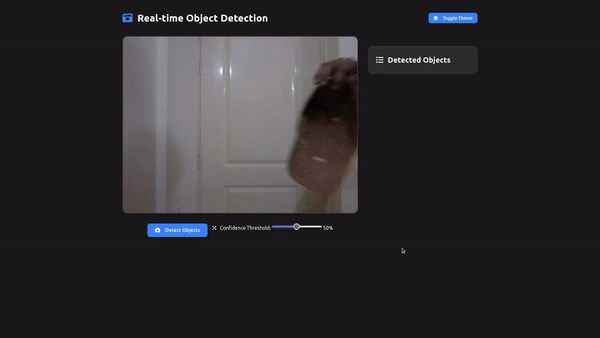</center>

## ✨ Features

- 🎥 Real-time object detection using YOLOv11
- 📏 Distance and angle estimation for detected objects  
- 🌐 Web-based interface with live video feed
- 🎚️ Confidence threshold adjustment
- 🔄 Temporal smoothing for stable detections
- 📊 Camera status monitoring and error handling

## 🎯 Object types
🥄 Spoon, 🧢 Cap, 📏 Comb, ⌚ Watch, ☕ Mug

## 📖 About
This project implements a real-time object detection and tracking system using YOLOv11, optimized for household objects. The system features:

- Custom-trained YOLOv11 model on household objects dataset
- Flask web application for easy interaction and monitoring
- Advanced camera handling with multiple source options
- Temporal smoothing algorithm to reduce detection jitter
- Distance estimation using object size references
- Angle calculation for spatial awareness
- Real-time visualization with confidence scores and labels

## 🚀 Installation

1. Clone the repository: 
```bash
git clone https://github.com/Stormynova/Object-detection-tracking.git
cd Object-detection-tracking
``` 

2. Install dependencies
- Windows
[Optional] Skip if already installed -
```bash
python --version # Make sure python is installed (https://www.python.org/downloads/release/python-3100/)
python -m ensurepip --upgrade
python -m pip install --upgrade pip
python -m pip install --upgrade virtualenv
```
Create and Activate the environment - 
```bash
python -m venv env
env\Scripts\activate
python -m pip install -r requirements.txt 
```
 
- Linux/Mac
```bash
sudo apt-get install python3-venv # Linux
python3 -m venv env
source env/bin/activate
pip install -r requirements.txt
```

## Project Structure

- `app.py`: Main Flask application with video processing and API endpoints
- `inference.py`: YOLO model implementation and object detection logic
- `prediction_smoother.py`: Temporal smoothing for stable detections
- `utils/`: Helper utilities including distance calculation
- `config/`: Configuration files for object sizes and camera parameters
- `static/`: CSS styles and JavaScript files
- `templates/`: HTML templates for the web interface

## Usage
1. Start the application:
```bash 
python app.py
```

2. Open your web browser and navigate to:
[http://localhost:5000](http://localhost:5000)

## Training

### Roboflow Setup:
```bash
export ROBOFLOW_API_KEY=YOUR_API_KEY
```

### Start Training:

1. Prepare your dataset in YOLOv11 format
2. Configure training parameters in `train.py`
3. Run training:

```bash
python train.py --augment # Use --augment flag for data augmentation
```

## YOLOv11 Training Results
### Training Plots
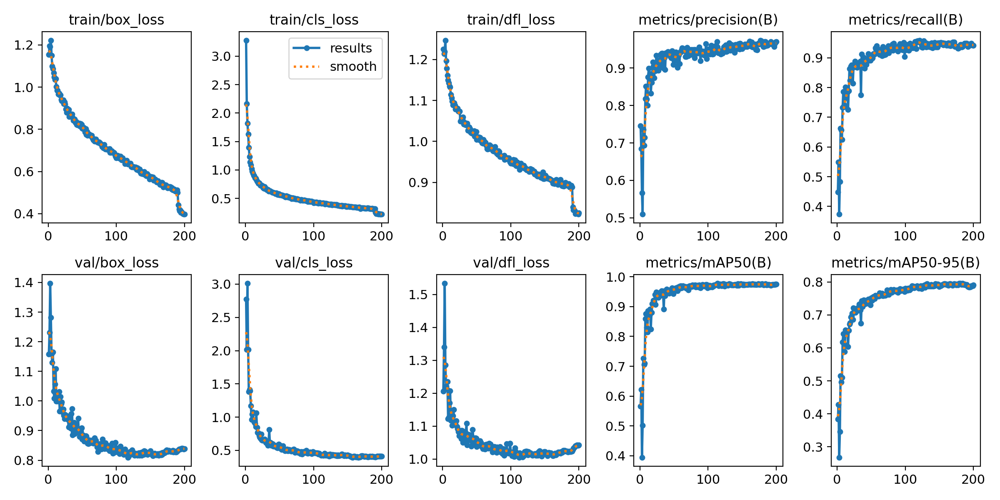
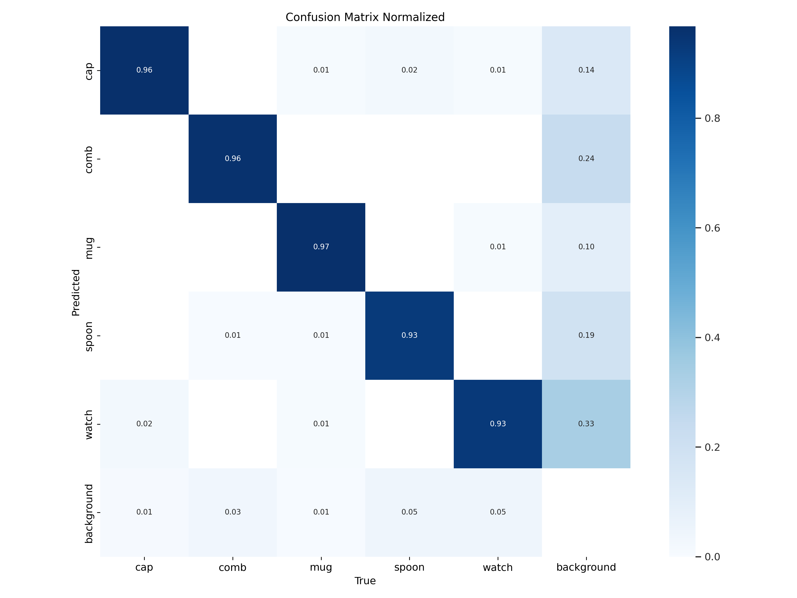
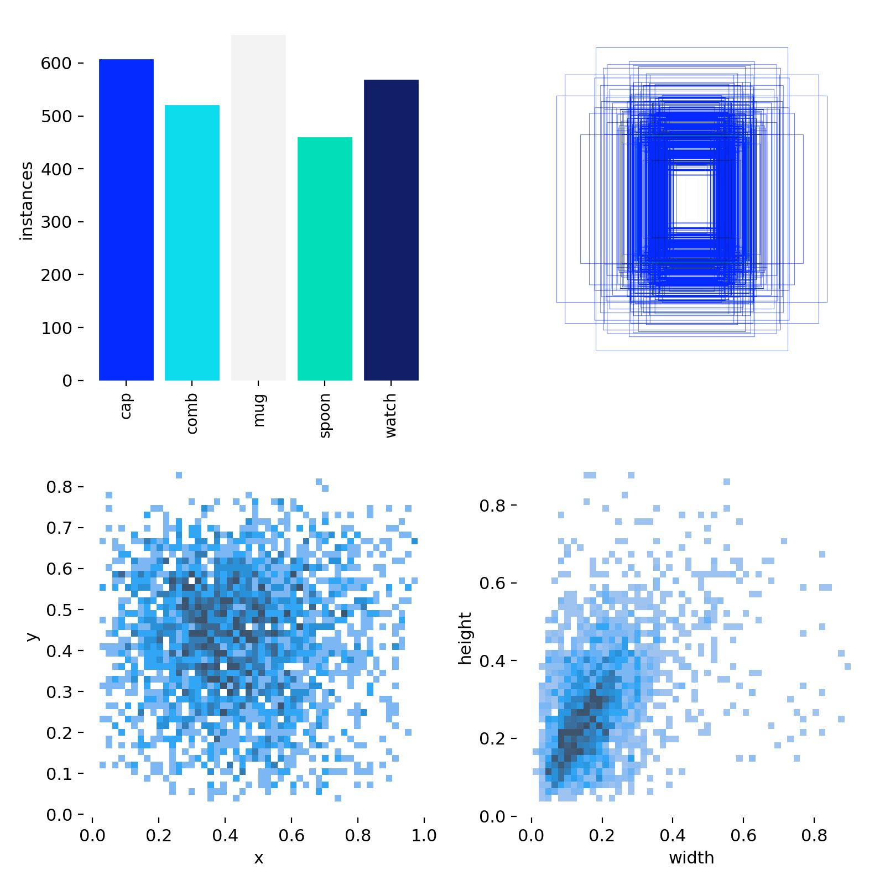
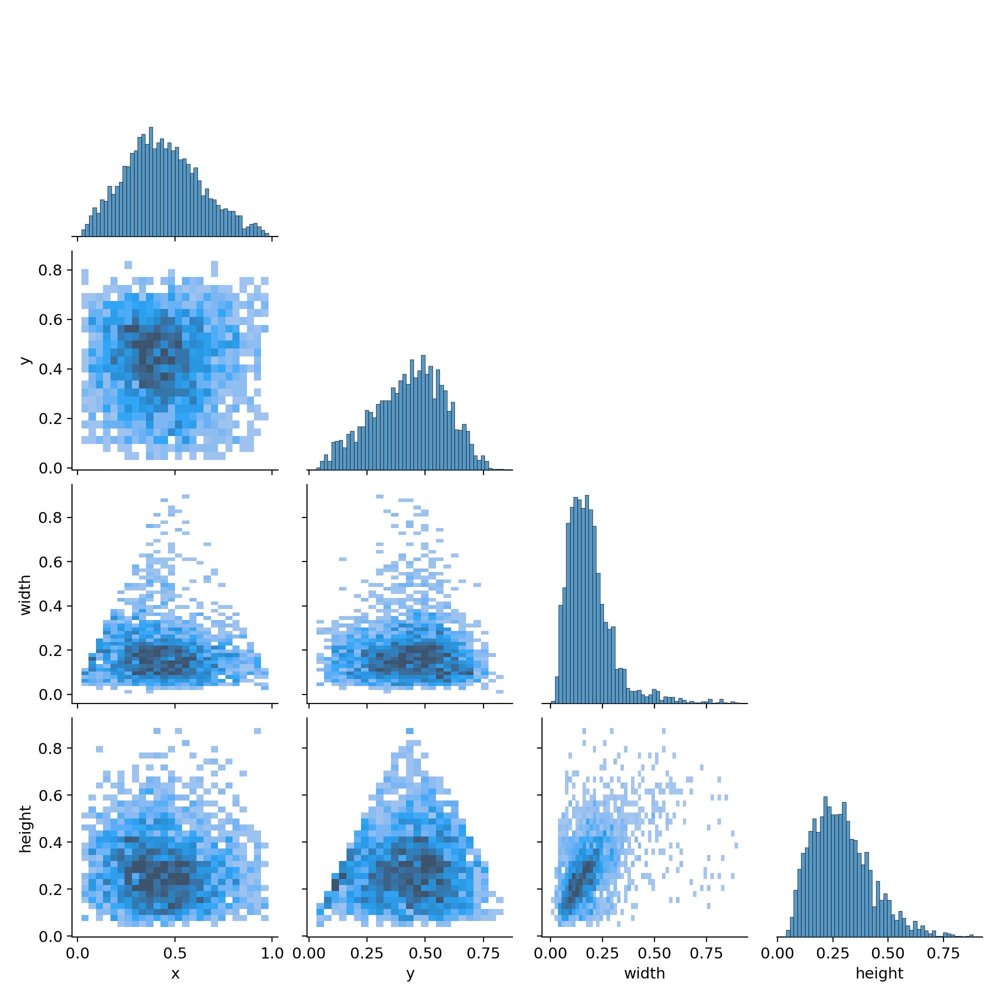
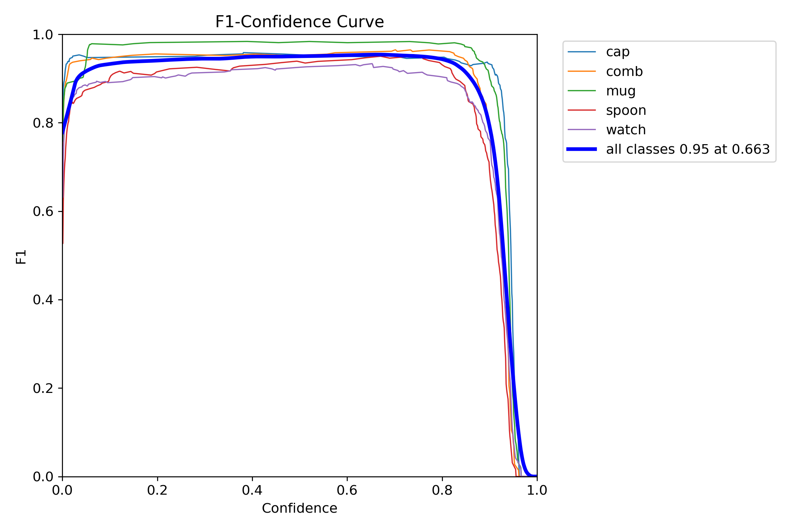
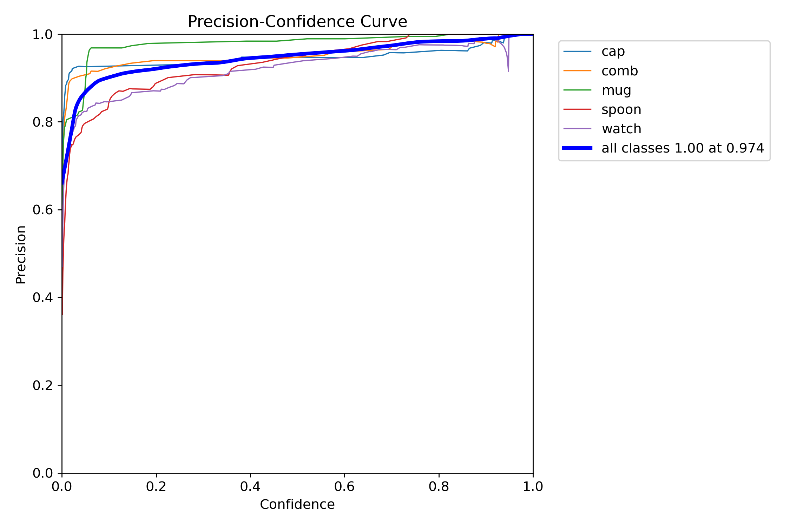
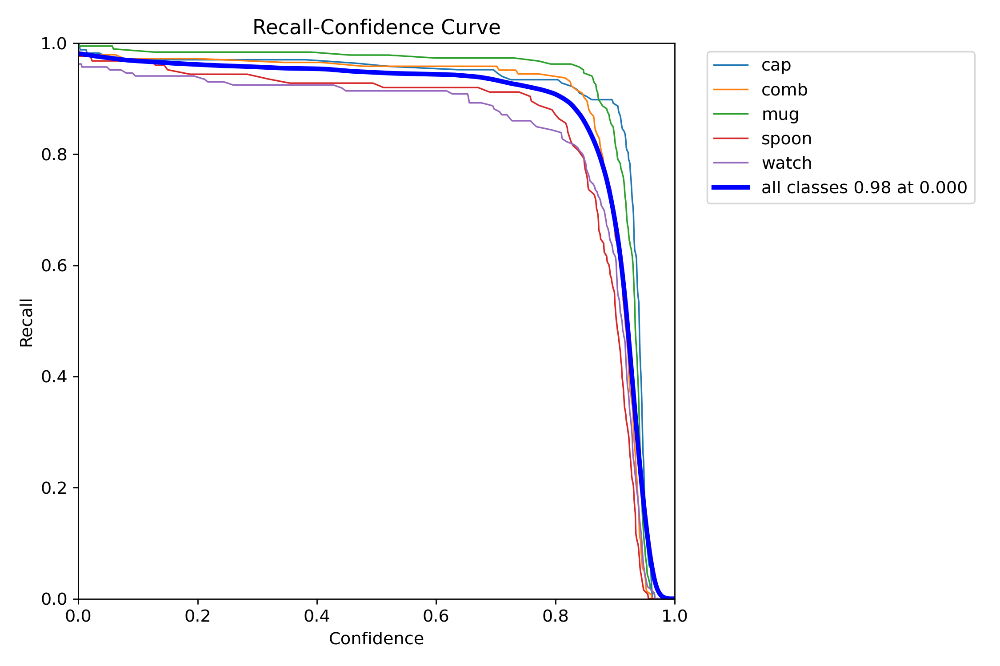
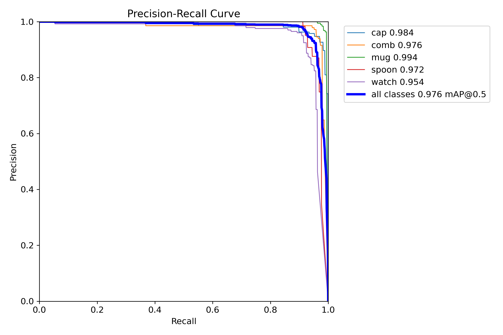

### Training Predictions
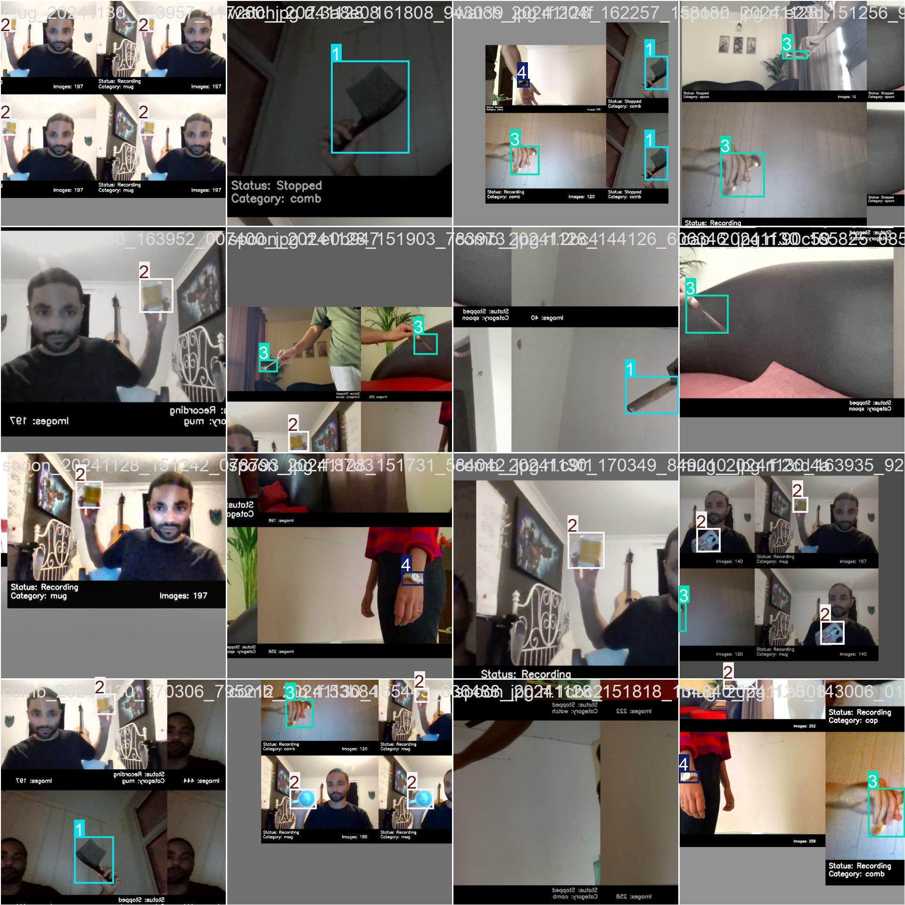

### Validation Predictions
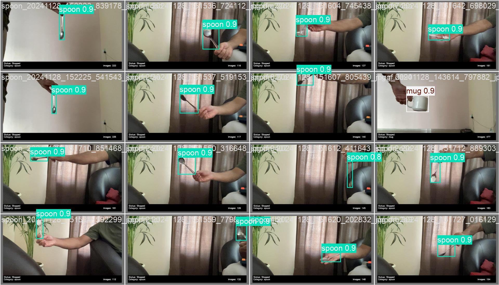

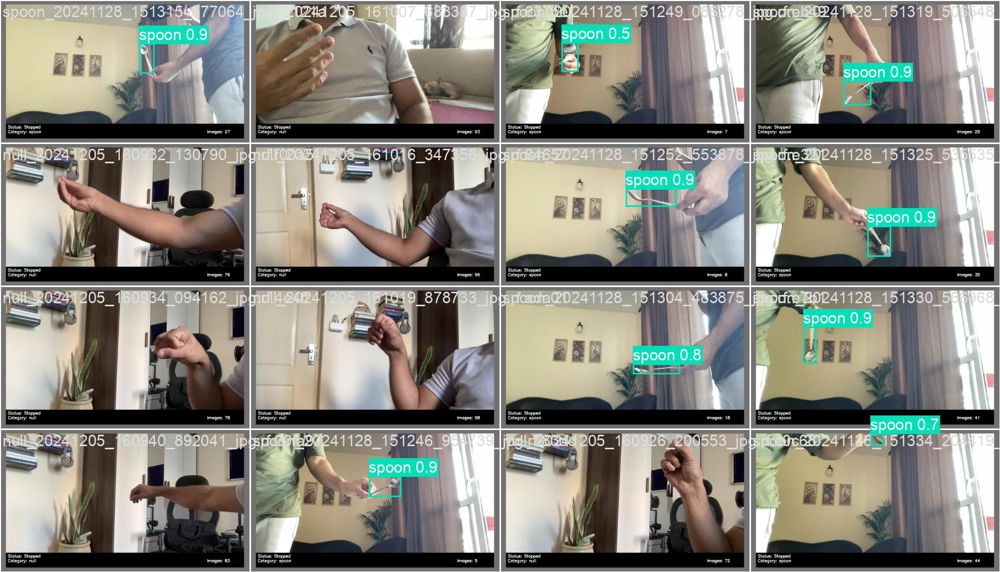

---
## Contribute
Please read [CONTRIBUTING](./CONTRIBUTING) for details
## [MIT License](./LICENSE)

## References
- [YOLOv11](https://github.com/ultralytics/yolov5)
- [Flask](https://flask.palletsprojects.com/)
- [OpenCV](https://opencv.org/)
- [NumPy](https://numpy.org/)
- [Pandas](https://pandas.pydata.org/)


## Debugging

1. Error: 
```bash
ERROR: Could not install packages due to an OSError: [Errno 2] - Tensorflow install error Windows longpath support not enabled
```
Solution: https://stackoverflow.com/questions/69950509/tensorflow-install-error-windows-longpath-support-not-enabled

2. Error: 
```bash
    + CategoryInfo          : SecurityError: (:) [], PSSecurityException
    + FullyQualifiedErrorId : UnauthorizedAccess
```
Solution: Before `env\Scripts\activate` -> Run `Set-ExecutionPolicy Unrestricted -Scope Process`
